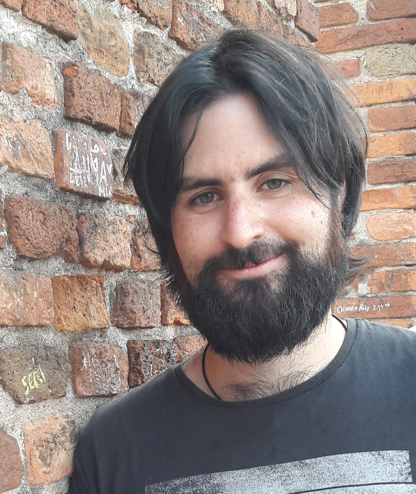

<!--

-->

Welcome to my website! My name is   **Massimiliano Russo**  and I am a postdoctoral research fellow in Statistics  at  **Harvard Medical School**  in the [Harvard Program in Therapeutic Science (HiTS)](http://hits.harvard.edu/) within the Harvard-MIT Center for Regulatory Science (CRS). I am also part of Prof. [Lorenzo Trippa](http://bcb.dfci.harvard.edu/~ltrippa/)'s group at the  **Dana-Farber Cancer Institute (DFCI)**  in the [Department of Data Sciences](https://www.dana-farber.org/research/departments-centers-and-labs/departments-and-centers/department-of-data-sciences/).

Before I was a PhD student in Statistics at the University of Padova (Italy), where I worked on Bayesian methods for tensor factorization models under the supervision Prof. [Bruno Scarpa](http://homes.stat.unipd.it/bruno/). During my PhD I spent about one year and an half as a visiting research scholar at Duke University, NC, USA working under the supervision of Prof. [David B. Dunson](https://stat.duke.edu/people/david-b-dunson).

My main research interests include: Bayesian statistics; Tensor factorization for categorical variables; Hierarchical models; Decision theory; 
Analysis and design of clinical trials; Machine learning; and, Computational statistics.

In this website you can find my [curriculum vitae](files/RussoCV.pdf), the list of my [publications](publications) and some [statistical material](material) (slides, tutorials etc.).  

I have also a [GitHub](https://github.com/rMassimiliano) profile.

## Education

* **2015--2019**, PhD in Statistical Sciences, University of Padova, Dept. of Statistical Sciences \
&nbsp;  &nbsp; &nbsp; &nbsp; &nbsp; &nbsp; &nbsp; &nbsp; &nbsp; &nbsp; 
Thesis: *Bayesian inference for tensor factorization models* \
&nbsp;  &nbsp; &nbsp; &nbsp; &nbsp; &nbsp; &nbsp; &nbsp; &nbsp; &nbsp; 
Advisor: [Bruno Scarpa](http://homes.stat.unipd.it/bruno/) 

* **2013--2015**, Master in Statistical Sciences}{University of Padova, Dept. of Statistical Sciences, Final Mark: 110/110 cum laude\
&nbsp;  &nbsp; &nbsp; &nbsp; &nbsp; &nbsp; &nbsp; &nbsp; &nbsp; &nbsp; 
 Thesis: *Olfactory perception differences in Italian regions: a nonparametric Bayesian approach to tensor factorization* \
&nbsp;  &nbsp; &nbsp; &nbsp; &nbsp; &nbsp; &nbsp; &nbsp; &nbsp; &nbsp; 
 Advisor: [Bruno Scarpa](http://homes.stat.unipd.it/bruno/); Co-advisor: Giancarlo Ottaviano.

* **2009--2013**, Bachelor in Statistical and Actuarial sciences, Università degli Studi del Sannio, Benevento, Final Mark: 110/110 cum laude \
&nbsp;  &nbsp; &nbsp; &nbsp; &nbsp; &nbsp; &nbsp; &nbsp; &nbsp; &nbsp; 
Thesis: Multivariate robust estimation \
&nbsp;  &nbsp; &nbsp; &nbsp; &nbsp; &nbsp; &nbsp; &nbsp; &nbsp; &nbsp; 
Advisor: [Luca Greco](https://sites.google.com/site/lucagrecohomepage)

## Awards

* Best poster award, second place winner for "Inference in Response-Adaptive Clinical Trials When the Enrolled Population Varies Over Time", ASA Biopharmaceutical Section Regulatory-Industry Statistics Workshop 2020.

* Best paper award for "Bayesian Inference on Group Differences in Multivariate Categorical Data" Dept. of Statistical Sciences, University of Padova (Research Prize 2018).

* Winner of the *3 minutes thesis competition* selection of Dept. of Statistical Sciences, University of Padova, October 19, 2018.

* Young researcher travel award ISBA2018,  Edinburgh, United Kingdom.

* Travel support for COBAL V (2017), Guanajuato, Mexico.

* Young researcher travel award ISBA2016, Sardinia, Italy.

